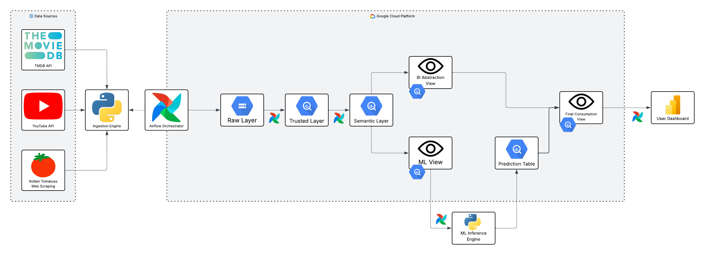

# 👁️ Project Precog — O Futuro das Notas de Cinema


O **Project Precog** é um ecossistema de dados *end-to-end* inspirado em *Minority Report*, projetado para prever o sucesso crítico de filmes antes de sua estreia através de metadados, análise de sentimento e tendências sociais.
Este é um projeto não comercial, somente para fins de fixação de aprendizado, explorando toda a stack técnica engenharia, governança, ciência de dados e analytics.

> *"Os Precogs nunca erram. Mas, às vezes... eles discordam."* — Relatório de Minoridade detectado em caso de anomalias de dados.

---

## 📌 Escopo de Atuação
Processar a linha do tempo cinematográfica através de:
- **Ingestão Multi-fonte:** TMDb API (Metadados) e YouTube API (Hype/Engajamento).
- **Scraping Ético:** Captura dirigida de ratings do Rotten Tomatoes para treinamento de modelos.
- **Governança por Design:** Documentação rigorosa de metadados, linhagem e qualidade de dados.
- **Predição:** Modelagem estatística para antecipar o "Audience Score" e "Tomatometer".
- **Premissas:** Custo zero, fim eduacional.

---

## 🏗️ Arquitetura da Solução

Abaixo está o fluxo completo de dados do **Project Precog**, desde a captura nas origens até a entrega da predição no dashboard.



🔗 [**Clique aqui para visualizar o diagrama interativo no Lucidchart**](https://lucid.app/lucidchart/22ed68c4-6d73-4734-9e80-438514f33f42/edit?viewport_loc=-279%2C9%2C3231%2C1509%2C0_0&invitationId=inv_02691bc4-7c4e-4f47-a724-8c633ebbc3ab)

> A arquitetura segue o padrão bronze → silver → gold no **Google BigQuery**, orquestrado via **Apache Airflow**, garantindo a linhagem e a integridade das camadas. 

---

## 🏗️ Arquitetura da Unidade de Contenção (Medallion + Consumption)

A arquitetura foi desenhada para garantir integridade, linhagem de dados e performance com **Custo Zero** (Free Tier):

1.  **Bronze (Raw Tank):** Ponto de entrada. Dados brutos (TMDb, YouTube, RT) armazenados em formato original para permitir o reprocessamento histórico completo.
2.  **Silver (Refining):** Limpeza, padronização de tipos e resolução de conflitos (Relatórios de Minoridade). Cruzamento das fontes externas em uma base relacional limpa.
3.  **Gold (Semantic Layer):** A "Verdade Única". Tabelas modeladas em formato multidimensional (**Star Schema**), organizando entidades como Filmes, Elenco e Métricas de Hype.
4.  **Consumo (Vision Layer):** Camada de **Views Dinâmicas** para entrega de dados otimizada:
    * **`vw_feature_store`**: Visão preparada e normalizada para o treinamento do modelo de Machine Learning.
    * **`vw_analytics_bi`**: Visão semântica com cálculos pré-agregados (DAX-ready) para o Power BI.

---

## 📦 Stack Tecnológica (Protocolo Precog)

| Camada | Tecnologia | Missão |
| :--- | :--- | :--- |
| 🌐 Origem de Dados | `TMDb / YouTube / RT` | Fontes de metadados e comportamento do público. |
| 🧪 Ingestão | `Python (Requests/BS4)` | Extração e carga na Unidade de Contenção. |
| 💾 Warehouse | `Google BigQuery` | Unidade de Contenção (Bronze, Silver, Gold). |
| ⚙️ Orquestração | `Apache Airflow` | O "Diretor" que coordena o fluxo das tarefas. |
| ✨ Transformação | `SQL (BigQuery)` | Refinamento Medallion e lógica de negócio. |
| 🤖 Ciência de Dados | `Scikit-Learn / BQML` | Modelos de regressão para predição de ratings. |
| 📊 Visualização | `Power BI` | Interface analítica de pre-crime para tomada de decisão. |
| 📐 Modelagem Conceitual | `dbdiagram.io` | Ferramenta online para criar diagramas ER claros e colaborativos. |
| 🔄 Linhagem de Dados | `OpenLineage` | Padrão aberto para rastreamento e controle de linhagem de dados. |
| 📖 Glossário de Dados | `Notion`, `Google Docs` ou `Markdown` | Plataformas colaborativas para manter definição clara de termos e métricas. |
| 🏗 Arquitetura da Solução | `Lucidchart` | Ferramenta visual para diagramas técnicos e fluxos, fácil de usar e compartilhar |

---

## 🧾 Documentação Auxiliar

- 🧩 Modelagem Conceitual
- 📚 Glossário de Dados
- 🔗 Linhagem de Dados
- 🗺️ [**Desenho de Solução**](https://lucid.app/lucidchart/22ed68c4-6d73-4734-9e80-438514f33f42/edit?viewport_loc=-279%2C9%2C3231%2C1509%2C0_0&invitationId=inv_02691bc4-7c4e-4f47-a724-8c633ebbc3ab)
 

---

## ⚙️ Como rodar o projeto

```bash
1. Configurar variáveis de ambiente:
   Crie um `.env` baseado no `.env.example` com suas chaves de API e credenciais GCP.
2. Ativar a Unidade de Contenção:
   ```bash
   python -m venv precog_env
   source precog_env/bin/activate  # ou .\precog_env\Scripts\activate
   pip install -r requirements.txt
```
---

## 👨‍💻 Autor
Leonardo Santiago  
- [LinkedIn](https://www.linkedin.com/in/leonardo-sposito-santiago)  
- [GitHub](https://github.com/LeoSantiag0)

---

## 🛡️ Licença
Este projeto é para fins exclusivamente educacionais e não possui fins comerciais. Utiliza a API pública da [TMDb](https://www.themoviedb.org/), porém **não é endossado ou certificado pela TMDb**.  
O uso da API respeita os [termos de uso da TMDb](https://www.themoviedb.org/documentation/api/terms-of-use) e é estritamente educacional e sem fins comerciais.